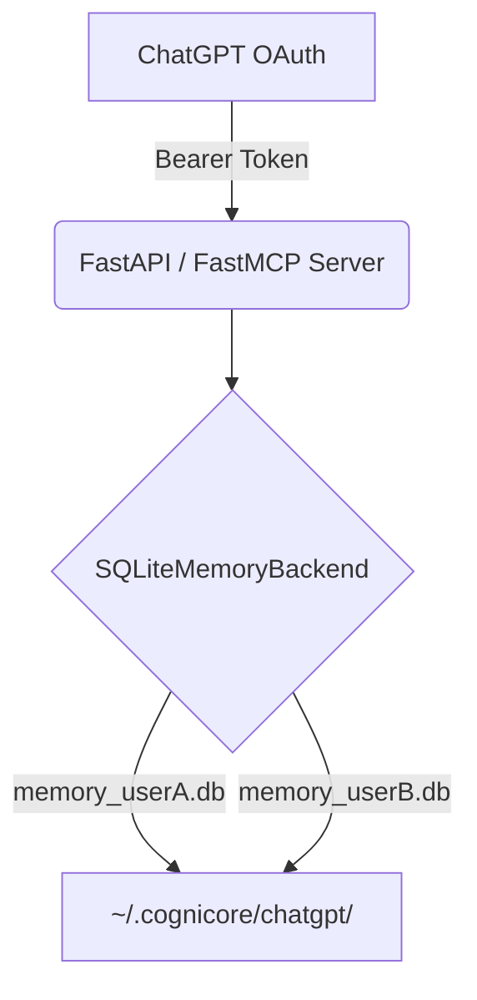
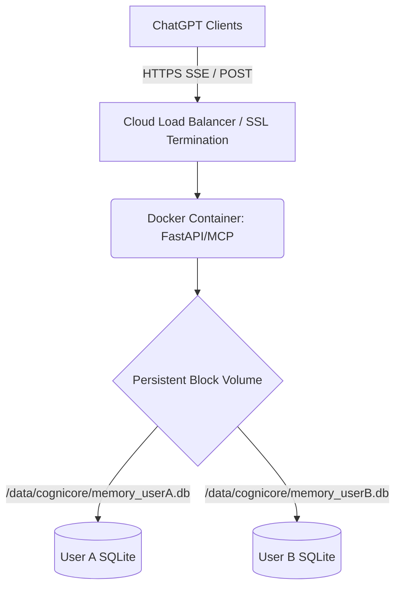

# CogniCore ChatGPT App Deployment Guide

## 1. Local Architecture (Development)
During local development, the architecture consists of the FastAPI server running natively (or via Docker) mapping tenant data to a local `.cognicore/` folder.

## 2. Production Architecture (Cloud Deployment)
For production deployment, the App must be hosted behind a public HTTPS endpoint with a persistent volume attached to prevent data loss when the stateless container restarts.

### Environment Variables Required
* `SUPABASE_URL`: The URL of your Supabase project (used for JWKS fetching).
* `COGNICORE_DATA_DIR`: Must be set to `/data/cognicore` (or wherever your persistent volume is mounted).

### Health Checks
The container exposes `GET /health` which returns `200 OK {"status": "ok"}` for load balancer readiness probes.
